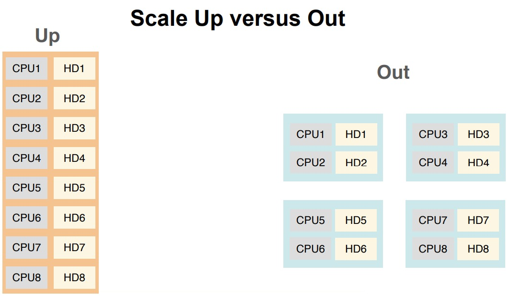

# Challenges of Distributed System

- **Coordination**: what happens when and to whom? And how
do you synchronize these events
- **Communication**: how do the different nodes in your system
talk to one another? And how do you talk to your nodes?
- **Fault Tolerance**: is your system robust to network and
machine failures (because they will happen)?