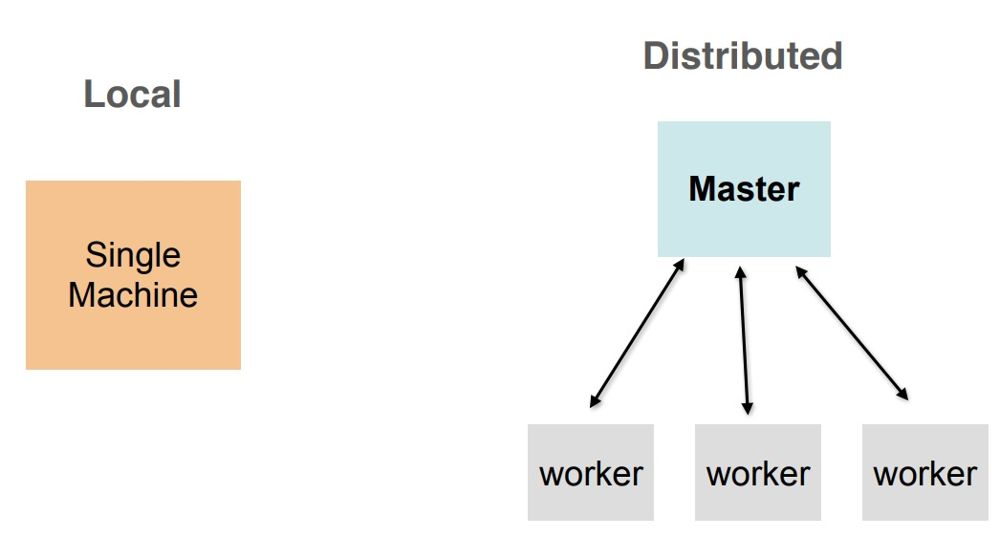
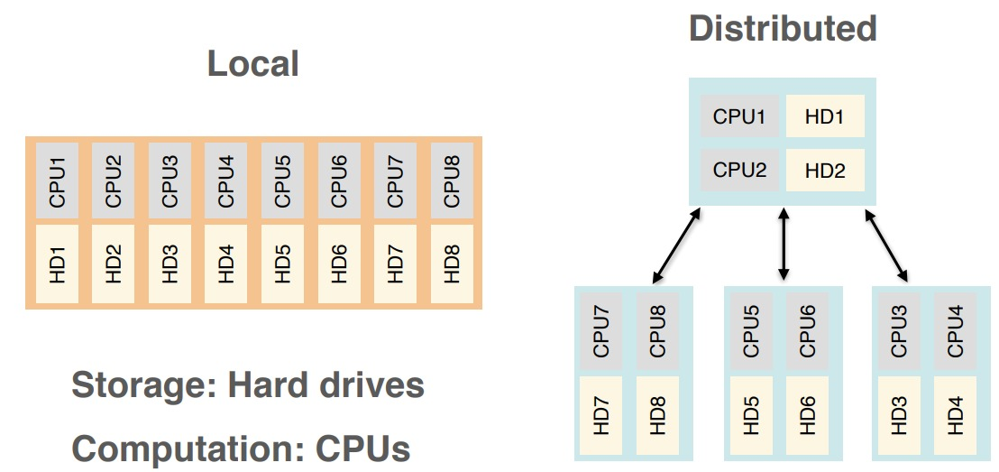

# Conceptual Introduction to Distributed Systems

### Illustration 1

- Illustration of a single machine computation with cluster in distributed fashion

### Illustration 2

- Slightly more realistic and detailed illustration