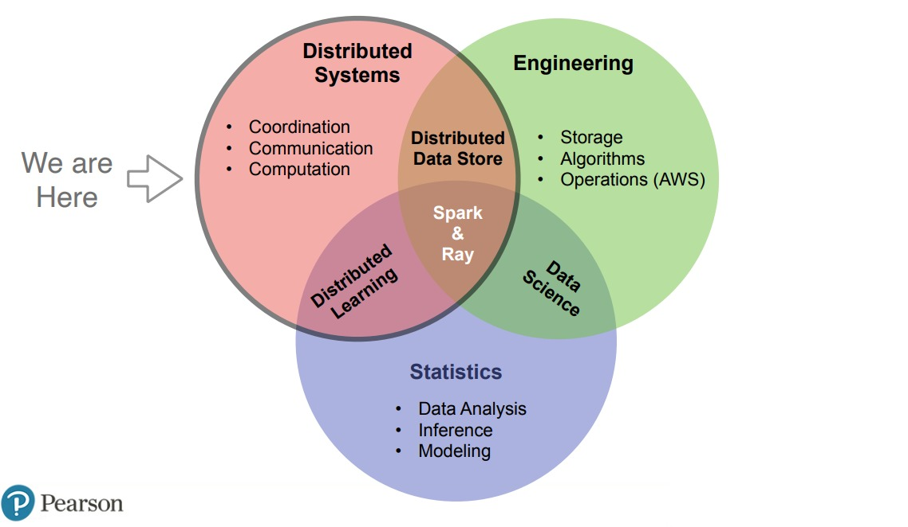

# Scaling Ray

import { Card, Cards } from 'nextra-theme-docs'

## Quick Start

<Cards num={5}>
  <Card
    arrow
    title="Distributed Computing with Ray"
    href="/">
  </Card>
  <Card
    arrow
    title="Remote Function"
    href="/">
  </Card>
    <Card
    arrow
    title="Stateful Distributed Computing"
    href="/">
  </Card>
    <Card
    arrow
    title="Autoscaling Machine Learning APIs"
    href="/">
  </Card>
    <Card
    arrow
    title="Comparison with Spark"
    href="/">
  </Card>
</Cards>

