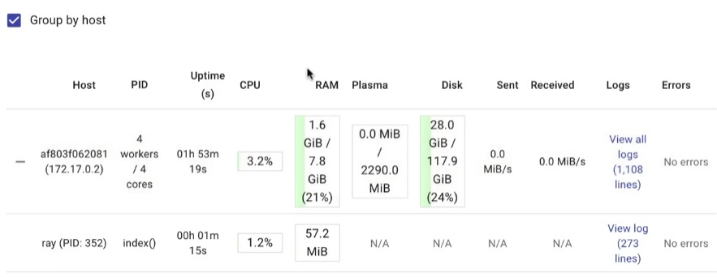

# Python Examples 

```py
import ray
import random, logging
import xml.etree.ElementTree as etree
```
```py
def parse_post(xml):
    return etree.fromstring(xml)
```
```py
posts = [
  '<row Id="1" Title="Eliciting priors from experts" />',
  '<row Id="2" Title="What is normality?" />',
  '<row Id="3" Title="What are some valuable Statistical Analysis open source projects?" />',
  '<row Id="4" Title="Assessing the significance of differences in distributions" />',
  '<row Id="5" Title="The Two Cultures: statistics vs. machine learning?" />',
  '<row Id="6" Title="Locating freely available data samples" />',
  '<row Id="7" Title="Forecasting demographic census" />',
  '<row Id="8" Title="Multivariate Interpolation Approaches" />',
  '<row Id="9" Title="How can I adapt ANOVA for binary data?" />'
]
```
```py
[ parse_post(xml) for xml in posts ]
```

>   Out[0]
>    ```py
>   [<Element 'row' at 0x7efdd8fc4b30>,
>   <Element 'row' at 0x7efdd8fc4400>,
>   <Element 'row' at 0x7efdd8fc4770>,
>   <Element 'row' at 0x7efdd8fc4db0>,
>   <Element 'row' at 0x7efdd8fc4e00>,
>   <Element 'row' at 0x7efdd8fc4e50>,
>   <Element 'row' at 0x7efdd8fc4ef0>,
>   <Element 'row' at 0x7efdd8fc4f40>,
>   <Element 'row' at 0x7efdd8fc4f90>]
>   ```

```py
def parse_post(xml):
    post = etree.fromstring(xml)
    print(post.get('Id'))
    return post
```
> Out[1]
> ```
> 1
> 2
> 3
> 4
> 5
> 6
> 7
> 8
> 9
> ```

```py
# Start Ray. If you're connecting to an existing cluster, you would use
# ray.init(address=<cluster-address>) instead.
ray.init(ignore_reinit_error=True, logging_level=logging.ERROR)
```

> Out[2]
> ```
>{'node_ip_address': '172.17.0.2',
> 'raylet_ip_address': '172.17.0.2',
> 'redis_address': '172.17.0.2:6379',
> 'object_store_address': '/tmp/ray/session_2021-02-19_01-41-08_832187_7103/sockets/plasma_store',
> 'raylet_socket_name': '/tmp/ray/session_2021-02-19_01-41-08_832187_7103/sockets/raylet',
> 'webui_url': '127.0.0.1:8265',
> 'session_dir': '/tmp/ray/session_2021-02-19_01-41-08_832187_7103',
> 'metrics_export_port': 61712,
> 'node_id': 'a387201aa5e27ea4052ebbab7cb1ca6ecfff19ce'}
> ```

```py
@ray.remote
def parse_post(xml):
    post = etree.fromstring(xml)
    print(post.get('Id'))
    return post
```

```py
future = parse_post.remote(posts[0])
```
> Out[3]
> ```py
> (pid=7195) 1
> ```

```py
ray.get(future)
```
> Out[3]
> ```py
> <Element 'row' at 0x7efdb8029720>
> ```

> Out[4]
> ```py
> (pid=7195) 1
> ```

```py
futures = [parse_post.remote(xml) for xml in posts ]
```

> Out[5]
> ```py
> (pid=7195) 1
> (pid=7195) 2
> (pid=7195) 4
> (pid=7195) 6
> (pid=7195) 8
> (pid=7194) 3
> (pid=7194) 5
> (pid=7194) 7
> (pid=7194) 9
> ```

```py
futures
```

> Out[6]
> ```py
> [ObjectRef(7bbd90284b71e599ffffffff0100000001000000),
>  ObjectRef(bd37d2621480fc7dffffffff0100000001000000),
>  ObjectRef(88866c7daffdd00effffffff0100000001000000),
>  ObjectRef(d251967856448cebffffffff0100000001000000),
>  ObjectRef(3bf0c856ace5a4d8ffffffff0100000001000000),
>  ObjectRef(72e11b46e93d91e4ffffffff0100000001000000),
>  ObjectRef(62223d85d5e7cd76ffffffff0100000001000000),
>  ObjectRef(3106d80c4e3c2369ffffffff0100000001000000),
>  ObjectRef(ae935fc0cb63c7d2ffffffff0100000001000000)]
> ```

```py
ray.get(futures)
```

> Out[7]
> ```py
> [<Element 'row' at 0x7efd70eb77c0>,
>  <Element 'row' at 0x7efd70eb7590>,
>  <Element 'row' at 0x7efd70eb78b0>,
>  <Element 'row' at 0x7efd70eb7900>,
>  <Element 'row' at 0x7efd70eb7950>,
>  <Element 'row' at 0x7efd70eb79a0>,
>  <Element 'row' at 0x7efd70eb79f0>,
>  <Element 'row' at 0x7efd70eb7a90>,
>  <Element 'row' at 0x7efd70eb7ae0>]
> ```

```py
[ el.get('Id') for el in ray.get(futures) ]
```

> Out[7]
> ```py
> ['1', '2', '3', '4', '5', '6', '7', '8', '9']
> ```

```py
@ray.remote
def parse_post(xml):
    post = etree.fromstring(xml)
    print(f"I'm Sleeping on: " post.get('Id'))
    sleep(.5)
    print(f"I'm Awake, time to get: " post.get('Id'))
    return post
```

```py
futures = [parse_post.remote(xml) for xml in posts ]
```

> Out[1]
> ```
> (pid=7195) I'm Sleeping on: 1
> (pid=7195) I'm Sleeping on: 2
> (pid=7195) I'm Sleeping on: 3
> (pid=7195) I'm Sleeping on: 4
> (pid=7195) I'm Awake, time to get: 1
> (pid=7194) I'm Sleeping on: 5
> (pid=7194) I'm Sleeping on: 6
> (pid=7194) I'm Awake, time to get: 2
> (pid=7194) I'm Sleeping on: 7
> ...
> ```

Run this url to access Ray Dashboard
- 'webui_url': '127.0.0.1:8265',

